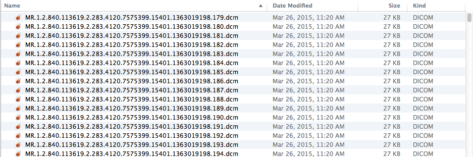

```{r, echo=FALSE}
source("../bin/chunk-options.R")
```
After your scans have been collected, the MRI technologist will do one of two things depending upon the policy at your particular MRI facility: (a) send your data to an archiving database (e.g., PACS or XNAT), or (b) burn a DVD with your data. Note that if your facility does not send data to an archiving database, you may be holding the only permanent copy of your scanning session. If your MRI facility sends data to a PACS or XNAT system, you will retrieve your data from your own computer when you get back to the office and the master data will be saved in the archive database.

## Retrieving your data<a name="retrieve"></a>

### Data on DVD

If you were given a DVD of your MRI data, make a copy of the data and store the original DVD in a secure place. You can then skip ahead to [Viewing your data](#view)

### Data in an archiving database

[XNAT](#xnat)  | [PACS](#pacs)

#### XNAT ([https://wiki.xnat.org/documentation/how-to-use-xnat/how-to-download-image-data-from-xnat-projects](https://wiki.xnat.org/documentation/how-to-use-xnat/how-to-download-image-data-from-xnat-projects))


#### PACS

Instructions specific to the BCCH MRI Research PACS can be found [here]({{ _extras }}/bcchr-pacs/).


## What kind of data do you get?

Almost all MRI scanners output neuroimaging data in DICOM format, a standardized medical image format. However, some MRI scanner vendors have developed specific data formats that are often the default data export type (e.g. [PAR/REC]({{ _extras }}/parrec/) on Philips scanners). If you do not receive your data in DICOM format, ask if DICOM export is possible. If not, see [here]({{ _extras }}/parrec/) for PAR/REC files.

Once you have downloaded your data, you will have a directory (aka folder) that looks something like this:




## How to convert data from DICOM to NIFTI

There are several good, free data conversion utilities available on the web that will convert the MRI data from the native scanner format to ANALYZE or NIFTI. Check out the dcm2nii webpage, which also lists several alternatives and the MRIconvert webpage. SPM and Brainvoyager have built-in solutions to convert DICOM data into a format specific for those packages. 


One important thing to realize when using third party tools is that they may change the original data in an unpredictable manner. For example, the orientation of left and right in the image may be flipped in an inappropriate manner, which may even be different for different MRI sequences that were obtained on the same scanner. Make sure to verify the image orientation before starting an experiment or its analysis. This can be easily verified by sticking a vitamin E capsule in the headcoil in a predetermined location.

### MRI convert

[`MRI convert`](http://lcni.uoregon.edu/downloads/mriconvert/mriconvert-and-mcverter) will convert data from SIEMENS, PHILIPS and GE scanners to various forms of NIFTI and ANALYZE format. The application is freely available and runs on Windows, Mac OsX and Linux. 

### Other tools

#### DICOM to NIFTI

[`dcm2nii`](http://www.cabiatl.com/mricro/mricron/dcm2nii.html) is a very complete DICOM and Philips PAR/REC converter that will run on Windows, linux and Mac OsX. Dcm2nii is provided as part of an image viewer package called MRIcron. This package is free to download and use and probably your best bet if you do not have an inhouse solution to convert medical images to NIFTI format.

#### SPM + Matlab

[`SPM`](http://www.fil.ion.ucl.ac.uk/spm/) has a tool that will allow the conversion of DICOM, MINC and ECAT data format to NIFTI; the default file format in SPM 8. Note that not all types of DICOM are supported. SPM requires Matlab to run.

#### FreeSurfer | mri_convert

[`mri_convert`](https://surfer.nmr.mgh.harvard.edu/) is a free general purpose utility for converting data between different file formats. It is distrubuted as part of FreeSurfer and is compatible with 24 formats. Amongst these formats are Siemens, GE and a Generic DICOM format.

#### Insight Segmentation and Registration Toolkit (ITK)

[`ITK`](https://itk.org/) provides a large set of tools for the neuroimaging community. Amongst the available tools are several tools to convert DICOM data to nifti.


